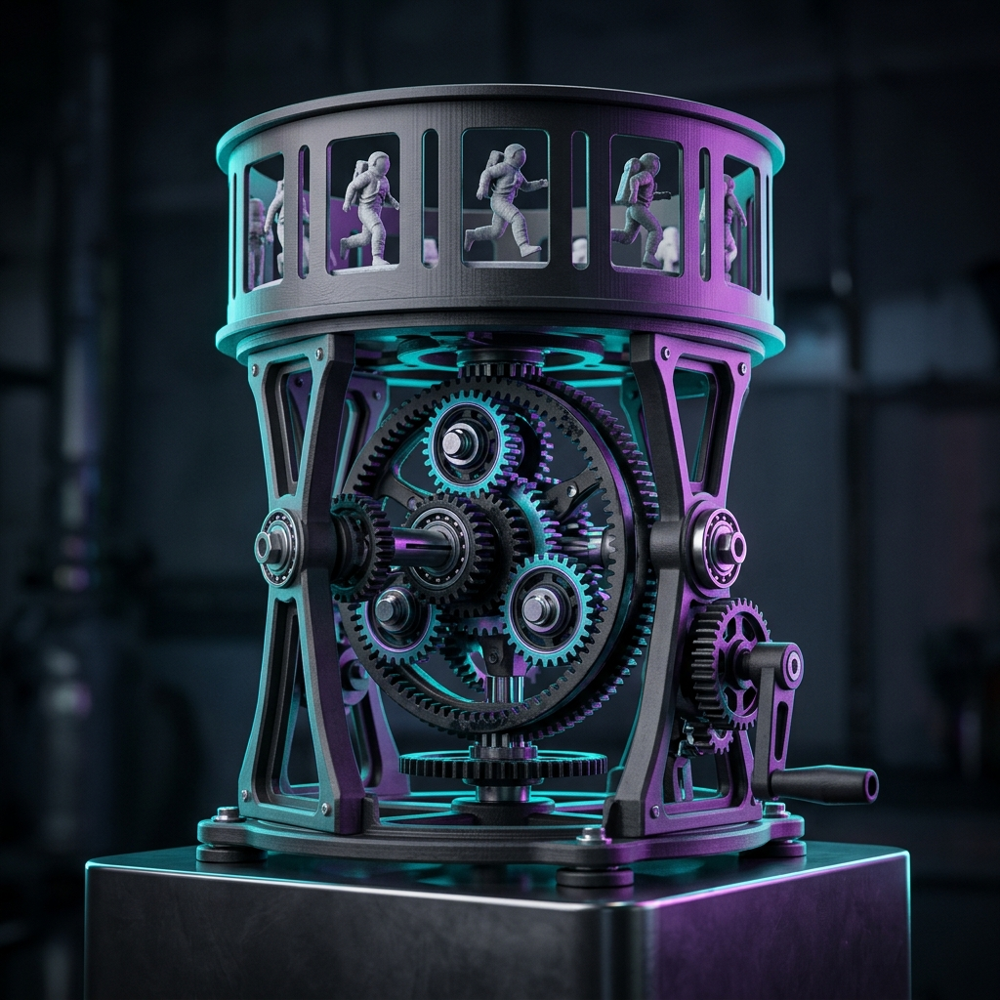
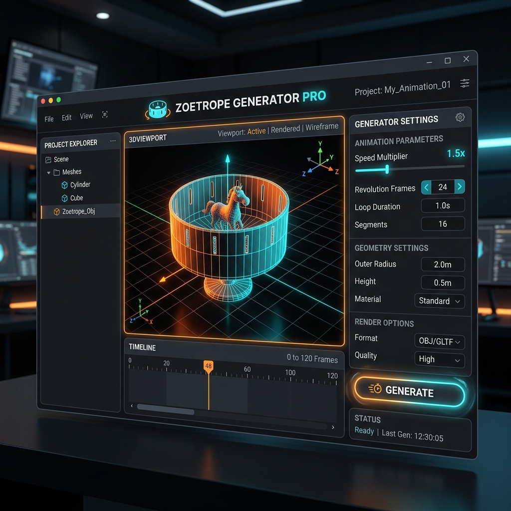

  
    
  
  # 🌀 Zoetrope Generator Pro
  *Breathe life into your 3D models with interlocking planetary gears and seamless looping magic.*
   

  
  
  

---

## 🚀 Unleash the Power of Illusion

**Zoetrope Generator Pro** is the ultimate toolset for Blender, designed to effortlessly turn any animation loop into a spectacular physical or digital zoetrope. Forget the manual math—let the power of automated planetary gear generation take the wheel.

### ✨ Features
- **One-Click Generation**: Automate the creation of physical zoetrope bases with precise planetary gear integration.
- **Dynamic Speed Control**: Counteract multi-speeds, set exact revolution frames, and watch the math solve itself.
- **Object Alignment**: Instantly align all instances to the Z-axis for perfect physical printing.
- **Export Ready**: Seamlessly batch-export to OBJ/GLTF and prepare your models for 3D printing.

 

  

 

---

## 🛠️ Installation

This add-on is fully compatible with Blender 4.2+ and uses the new Extensions architecture.

1. Download [`zoetrope_generator_pro.zip`](zoetrope_generator_pro.zip).
2. Open Blender and go to **Edit > Preferences > Get Extensions**.
3. Click the dropdown arrow in the top right and select **Install from Disk...**
4. Select the downloaded `.zip` file.
5. Enable the extension and access the **Zoetrope Generator** panel in the 3D Viewport side panel (N).

---

## 📚 Documentation & Theory

Ever wondered how the math works for generating these complex spinning mechanisms? Check out our detailed findings and equations:

> 📖 **[Read the Planetary Gear White Paper here](Planetary_Gear_White_Paper.pdf)**

---

  <i>Created with 🤍 by the Corridor Crew</i>

